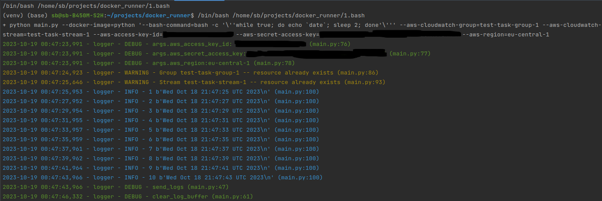

# Docker Runner 2049 

How to run:

```bash
python \
main.py \
--docker-image=python \
--bash-command="bash -c 'while true; do echo \`date\`; sleep 1; done'" \
--aws-cloudwatch-group=two049-task-group-1 \
--aws-cloudwatch-stream=two049-task-stream-1 \
--aws-access-key-id="AXXXXXXXXXXXXXXXXXXX" \                    
--aws-secret-access-key="x0+XxxxxXXXXXXXXXXxxx/XxxxxxxxxXxxxxxx+X" \
--aws-region=eu-central-1
```
But first replace 
--aws-access-key-id="AXXXXXXXXXXXXXXXXXXX" \                    
--aws-secret-access-key="x0+XxxxxXXXXXXXXXXxxx/XxxxxxxxxXxxxxxx+X" \
to your own keys

Result:
[]